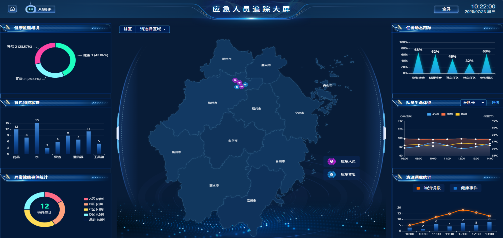

<h1 align="center">big-screen-vue</h1>

<p align="center">
  <strong>一个基于 Vue.js、DataV 和 ECharts 构建，专为大屏优化的数据可视化面板项目。</strong>
</p>

<p align="center">
  <a href="https://github.com/woshidasg/big-screen-vue"></a>
  <a href="https://github.com/woshidasg/big-screen-vue/fork"></a>
  
  
  
  
</p>

## 📖 开源信息

本仓库由 [@woshidasg](https://github.com/woshidasg) 进行开发和维护。欢迎大家 Star、Fork，并提出宝贵的意见。

---

## 效果展示



## ✨ 功能特性

- **数据可视化**: 集成 [Apache ECharts](https://echarts.apache.org/zh/index.html) 和 [DataV](http://datav.jiaminghi.com/)，提供丰富的图表和可视化组件。
- **动态布局**: 采用 `Left-Center-Right` 的经典大屏布局，组件化开发，易于维护。
- **屏幕自适应**: 使用 CSS3 `scale` 方案，支持不同分辨率屏幕的自适应显示。
- **模块化**: 清晰的项目结构，将视图、组件、API 和状态管理分离。
- **Vue 生态**: 整合 `Vue Router` 进行路由管理，`Vuex` 进行状态管理。
- **地理信息可视化**: 使用 ECharts 地图组件，支持省市区三级联动地图展示，提供区域下钻功能。
- **应急指挥定位**: 在地图上标记应急人员位置，展示关键健康数据如心率、血氧和体温，辅助应急指挥决策。

## 🛠️ 技术栈

- **核心框架**: [Vue.js](https://cn.vuejs.org/) 2.x
- **状态管理**: [Vuex](https://vuex.vuejs.org/zh/)
- **路由**: [Vue Router](https://router.vuejs.org/zh/)
- **数据可视化**:
  - [Apache ECharts](https://echarts.apache.org/zh/index.html)
  - [@jiaminghi/data-view](http://datav.jiaminghi.com/)
- **地图数据**: [阿里云DataV GeoAtlas](https://datav.aliyun.com/portal/school/atlas/area_selector) 提供的地理数据
- **HTTP 请求**: [Axios](https://axios-http.com/)
- **CSS 预处理器**: [Sass](https://sass-lang.com/)
- **图标**: [Vue-Awesome](https://github.com/Justineo/vue-awesome)

## 📁 项目结构

```
.
├── public/
├── src/
│   ├── api/          # API 请求
│   ├── assets/       # 静态资源 (图片, 样式)
│   ├── components/   # 可复用组件
│   ├── router/       # 路由配置
│   ├── store/        # Vuex 状态管理
│   ├── utils/        # 工具函数
│   └── views/        # 页面视图
│       └── index.vue # 主页面
├── package.json      # 项目依赖和脚本
├── vue.config.js     # Vue CLI 配置文件（已配置好代理）
```

## 🚀 快速上手

### 1. 环境准备

确保您的开发环境已经安装了 [Node.js](https://nodejs.org/) (建议版本 >= 16) 和 [pnpm](https://pnpm.io/)。

### 2. 安装依赖

在项目根目录下执行以下命令：

```bash
pnpm install
```

### 3. 运行项目

执行以下命令以启动开发服务器：

```bash
pnpm run serve
```

启动后，在浏览器中打开 `http://localhost:8080` (或其他指定的端口) 即可查看。项目推荐在全屏模式下（按 F11）浏览以获得最佳体验。

### 4. 项目打包

执行以下命令以进行生产环境打包：

```bash
pnpm run build
```

打包后的文件将生成在 `dist` 目录中。

## 🔧 定制化指南

### 更换图表

所有图表组件都位于 `src/views/components` 目录下，并按照布局（`left`, `center`, `right`）进行组织。您可以直接修改这些组件内的 ECharts 配置项来更换图表样式和数据。

ECharts 的配置可以参考 [ECharts 官方示例](https://echarts.apache.org/examples/zh/index.html)。

### 调整布局

项目的主要布局在 `src/views/index.vue` 文件中定义。您可以修改此文件来调整整体布局结构，或者修改 `src/assets/scss/index.scss` 文件来调整各区域的样式。

### 更换边框

项目中的边框使用了 `DataV` 的 `dv-border-box` 系列组件。您可以在 `.vue` 文件中找到类似 `<dv-border-box-12>` 的标签，并根据 [DataV 官方文档](http://datav.jiaminghi.com/guide/borderBox.html) 将其更换为您喜欢的边框样式。

### 数据请求

项目中预配置了 `axios` 用于数据请求。建议在 `src/api` 目录下创建和管理您的 API 请求。

### 地图配置

项目中的地图组件支持省市区三级联动，使用阿里云DataV提供的地理数据。您可以在`src/views/components/CenterPanel.vue`文件中：

- 修改`provinces`数组添加更多省份
- 调整地图样式和交互效果
- 配置显示的地图标记点
- 自定义地图悬浮提示框内容

地图标记点支持显示关键指标数据，如心率、血氧和体温等实时监控数据。

## 🤝 贡献

欢迎提交问题、bug 反馈或功能请求。如果您对项目有任何改进建议，请随时提交 Pull Request。

## 📄 License

This project is licensed under the MIT License. See the [LICENSE](LICENSE) file for details.